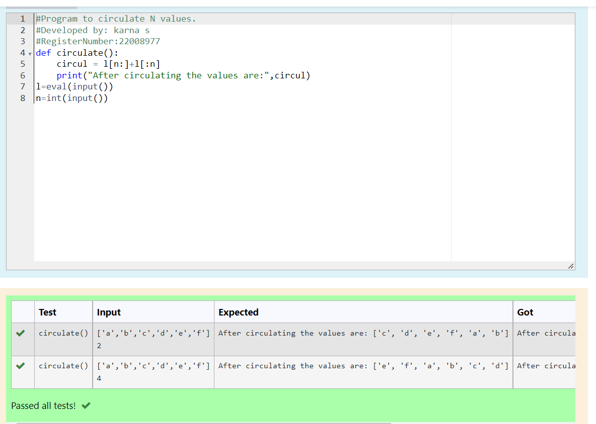

# Circulate-the-values-of-N-variables
## Aim:
To write a python program to circulate the n variables using function concept
## Equipment’s required:
PC
Anaconda - Python 3.7
## Algorithm: 
### Step 1: 
Define a function
### Step 2: 
Enter the formula
### Step 3: 
Get the value from the user for the number of rotation
### Step 4: 
Using the slicing concept rotate the list

### Step 5:
Print the values after circulating
### Step 6: 
End the program

## Program:
```python
#Program to circulate N values.
#Developed by: karna s
#RegisterNumber:22008977
def circulate():
    circul = l[n:]+l[:n]
    print("After circulating the values are:",circul)
l=eval(input())
n=int(input())
```
## Output:

## Result:
The circulating n variables using function concept is succesfully executed.
